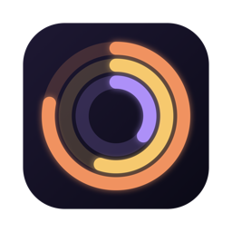

<div align="center">



# AI Limits

**Your Claude and ChatGPT usage limits, beautifully visible on macOS.**

Menu bar · Notch · Floating window · Desktop widgets


</div>

---

Hitting a usage limit in the middle of your work is frustrating. **AI Limits** keeps your session, weekly and per-model limits (such as Fable) in view all day, with live reset countdowns, so you always know how much room you have left.

## ✨ Features

### 🎛 Menu bar dashboard
A gauge icon with your current Claude session % lives in the menu bar. Click it to open a frosted-glass dashboard with every limit and its reset time. Switch between three styles:

- **Rings**: Activity-style concentric rings
- **Bars**: clean progress bars
- **Dials**: clock-face tick dials with big numbers

### 🏝 Notch mode
Two tiny gauges sit on either side of your MacBook's notch. Hover over the notch and it expands into a Dynamic Island-style panel with a ring tile for every limit.

### 🪟 Floating window
Pop the dashboard out into a resizable window. Pin it on top of every desktop, or shrink it down to a compact bar list that stays out of your way.

### 🧩 Desktop widgets
Four widget styles that blend into the macOS desktop glass:

| Widget | Sizes | What it shows |
| --- | --- | --- |
| **Dial** | Small | One limit as a big clock-style dial (you choose which) |
| **Rings** | Small, Medium | All limits of Claude or ChatGPT as concentric rings |
| **Bars** | Small, Medium | Progress bars with reset times |
| **Overview** | Medium, Large | Claude and ChatGPT side by side |

Right-click any widget and choose **Edit** to pick the provider or meter.

### 🎨 Smart colors
Each limit has its own color: coral for session, amber for weekly, violet for model limits, mint and sky for ChatGPT. Any limit at 90% or higher turns red.

## 📦 Requirements

- macOS 14 Sonoma or later
- Xcode 16 or later
- [XcodeGen](https://github.com/yonaskolb/XcodeGen): `brew install xcodegen`
- [Claude Code](https://claude.com/claude-code) signed in, for Claude limits
- [Codex CLI](https://github.com/openai/codex) signed in, for ChatGPT limits

You only need the tool for the service you want to track.

## 🚀 Install

```sh
git clone https://github.com/ahm3drgb/ai-limits.git
cd ai-limits
./install.sh
```

The script generates the Xcode project, builds a Release copy, installs it to `~/Applications/AI Limits.app` and launches it. Look for the gauge icon in your menu bar.

On first launch, macOS may ask to allow access to the `Claude Code-credentials` keychain item. Click **Always Allow**.

**Add a widget:** right-click the desktop → **Edit Widgets…** → search **AI Limits** → drag a widget onto the desktop.

**Turn on notch mode:** open the menu bar panel and click the notch button at the bottom.

## 🔒 Privacy

- No account, no sign-up, no analytics.
- The app reuses the logins that Claude Code and Codex CLI already keep on your Mac.
- Your credentials are only ever sent to the provider they belong to (Anthropic or OpenAI).
- The only thing the app saves is a small file of percentages and reset times at `~/Library/Application Support/AILimits/snapshot.json`, which the widgets read.

## ⚙️ How it works

Every 2 minutes the app asks Anthropic and OpenAI for your current usage, using the same usage endpoints Claude Code and Codex CLI use for their own usage screens. It saves the result for the widgets and tells macOS to refresh them.

> **Note:** these endpoints are not public APIs and may change without notice. If one changes, the app shows an error rather than wrong numbers.

## 🗂 Project structure

```
App/        Menu bar app: dashboard, floating window, notch, data fetching
Widget/     WidgetKit extension: Dial, Rings, Bars, Overview
Shared/     Models, snapshot store, ring, dial, bar and tile components
project.yml XcodeGen project spec
install.sh  Build and install script
```

## ⚠️ Disclaimer

AI Limits is an independent project. It is not affiliated with, endorsed by or sponsored by Anthropic or OpenAI. Claude is a trademark of Anthropic. ChatGPT and Codex are trademarks of OpenAI.

## 📄 Copyright

Copyright © 2026 **Ahmed Abokhalil**. All rights reserved.

See [LICENSE](LICENSE) for details.

---

<div align="center">

Made with ❤️ by **Ahmed Abokhalil**

</div>
